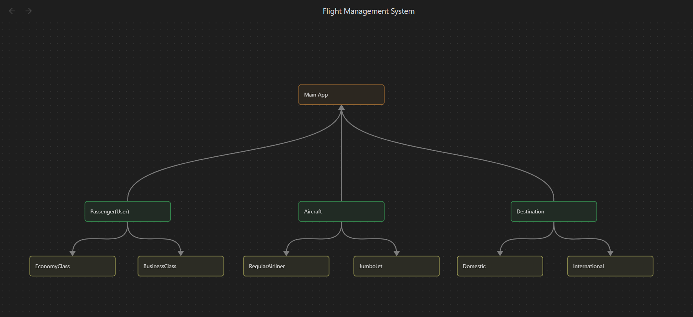

BlueSkyAirlines Flight Registration Management System
-
A simple flight registration managment system that runs on the console.

CORE FEATURES:
Current Flight logs, Mini Form for registration, Flight Miles calculation for Economy and Business class passengers,
Benefits display for both passenger plans, Available Aircraft with capacity and other detail, Basic registration form
decision-making, Packages for improved organization, Private access modifier for data privacy.

USAGE DOCUMENTATION:
1. Download the **.zip** file of this project.
2. Extract contents in any folder.
3. Open the **src** folder. 
4. Find the **MainApp.java** file. It should be there.
5. Right-click and open the command prompt **in same folder**.
6. Type the following: **java MainApp.java**
7. Press **enter** and proceed with program.

N.B. - You may also clone this repository and open in **Intellij IDEA**.

CONCEPTS ADDRESSED:
Polymorphism (Method overloading and overriding, inheritance(Hierarchical)), Access modifiers used(Public, private), 
Objects instantiated with real-world modeling, getters and setters used to obtain private variables, limited input
validation, Inheritance(clear IS-A relationship)

Reference
-
INHERITANCE LOGIC:

CONCEPT IMPLEMENTATIONS:

Polymorphism:

Method overloading - Destination.java -> lines 19, 35 , MainApp.java -> lines 176-177

Overriding - DomesticAirliner.java, JumboJet.java, TransoceanicAirliner.java

Basic Exception handling(validation) - Destination.java -> line 37, EconomyClassPassenger.java -> line 64
Inheritence - (Can be seen thoughout project)

Encapsulation:

(private variables, getters and setters)
(private fields) - Aircraft.java -> lines 7-12
(mutators) - Aircraft.java, Passenger.java -> lines 28-76

Access modifiers: 

(public, private)
public - can be seen throughout
private - in fields as aforementioned

Classes and Object:

Classes - can be seen throughout
Objects - MainApp.java -> lines 11-15, lines 20-21, lines 24-28, lines 34-39

